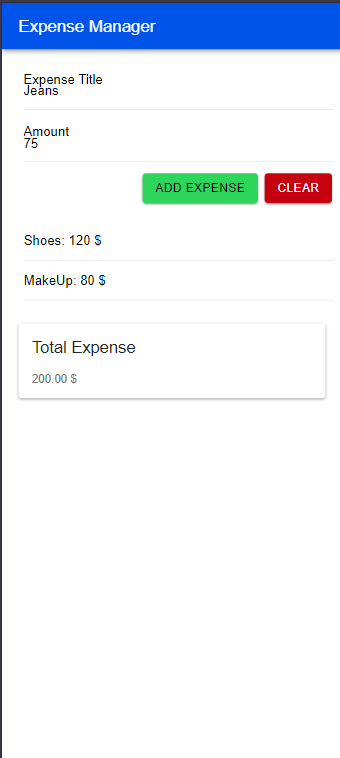

# Expense Manager

**Expense Manager** is a simple web application built with Vanilla JavaScript and Ionic components. It allows users to manage their expenses by adding titles and amounts. The application dynamically updates the total expense and provides a clean interface for tracking.

## Features

- Add and list expenses dynamically
- Calculate total expenses in real-time
- Clear form inputs after each addition
- Simple and mobile-responsive interface

## Screenshots

### Main Interface

The main interface allows users to enter expense details and displays the total amount.

### Adding an Expense

When an expense is added, it is displayed in the list with the corresponding amount.

### Total Expense Calculation

The total expenses are calculated and updated each time a new expense is added.

## What I Learned ! ! !

During this project, I strengthened my understanding of the following concepts:

- **DOM Manipulation**: Directly interacting with HTML elements using JavaScript to dynamically update the content based on user input.
- **JavaScript Event Handling**: Learning how to handle button clicks and form submissions to trigger specific functions.
- **Input Validation**: Ensuring that valid data is entered before updating the expense list.
- **Ionic Components**: Using Ionic’s pre-built UI components such as buttons, inputs, and cards to build a clean and responsive design.
- **CDN**: A Content Delivery Network (CDN) is a system of distributed servers that deliver content (like libraries or files) to users based on their geographic location, improving loading times. In this project, Ionic components are served via a CDN.

## HTML Tags and Their Types

- **Inline Elements**: These elements do not start on a new line and only take up as much width as necessary. Examples include:
  - ``: Used for grouping inline elements.
  - `<button>`: Creates a clickable button.
- **Block Elements**: These elements start on a new line and take up the full width available. Examples include:
  - `
`: A container element used for grouping block elements.
  - `<section>`: Represents a standalone section in a document.

## Role of JavaScript

JavaScript plays a crucial role in **dynamizing** web pages by allowing interaction based on user behavior. For instance, in this project:

- It adds new expenses to the list dynamically.
- It updates the total expenses automatically when a new expense is added.
- It validates user inputs and triggers alerts when necessary.

JavaScript enables the web page to become more **interactive**, responding to user actions such as button clicks, form submissions, and other events.
